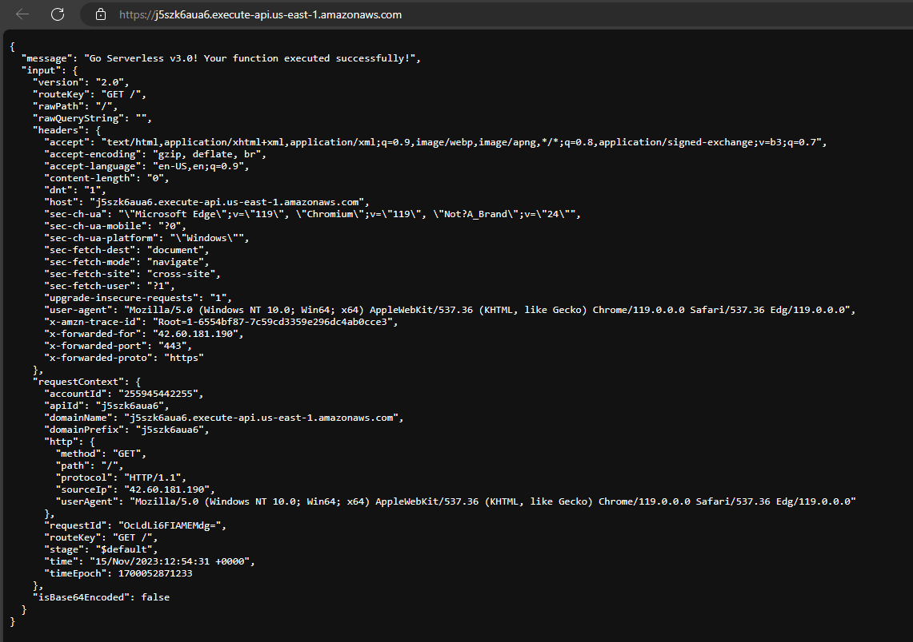

# 3.12 Lesson

### Activities for today

Create a Github repository and clone to your local machine. Do update the readme file and push to the repository
```
git clone
```
```
git add
```
```
git commit
```
```
git push
```

Initialize the "npm" application

```
npm init
```

Create index.js 

Create the serverless.yml file

Install the npm serverless application

```
npm install serverless
```

```
npm install serverless-offline --save-dev
```

Add file .gitignore to ignore node_modules

Run the offline serverless

```
serverless offline start
```

Command line execution


Localhost verification


Function verification


Update the yml service name

Run the serverless deploy command
```
serverless deploy
```


Verify the Lambda function

Verify the lambda servce


Verify the endpoint


Do github workflows
